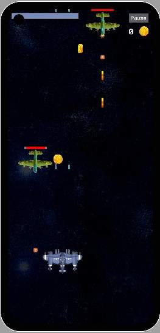

# 2D Plane Shooting Game

A simple **2D plane shooting game** built with **Unity** and **C#**, featuring interactive animations and visually appealing 2D sprites. Engage in thrilling aerial combat, dodge and shoot enemy planes, collect coins, and survive till to game end!

## Features

- Player-controlled plane
- Enemy planes
- Collision detection
- Coin collection system
- Health damage

## Picture




## 🛠️ Technologies Used  
- **Unity** – Game engine for building and optimizing the gameplay.  
- **C#** – Scripting for game mechanics and interactions.  
- **2D Sprites & Animations** – Good-quality assets for a visually appealing game.

## Getting Started

1. Clone the repository:
   ```bash
   git clone https://github.com/your-username/2D-Plane-Shooting-Game.git
